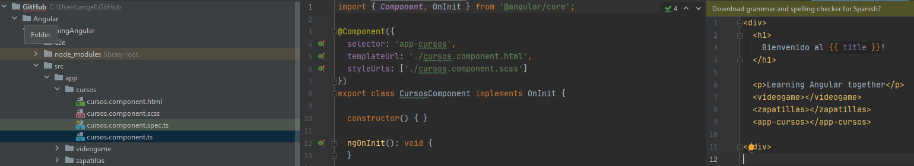

# Angular

Todos los archivos de este repositorio han sido escritos integramente por Ángel Garrido Álvarez. En estos documentos repaso los fundamentos de Angular que quedan reflejados en este archivo README.md que explica lo que se ha hecho en la carpeta learningAngular.

El contenido se ha redactado mientras cursaba el [Master en JavaScript: Aprender JS, jQuery, Angular, NodeJS](https://www.udemy.com/course/master-en-javascript-aprender-js-jquery-angular-nodejs-y-mas/) de Víctor Robles, por lo que la mayor parte del contenido proviene de esta fuente.


## INDICE
0. [Sobre Angular JS](#id0)
1. [Principaes comandos de Angular](#id1)
2. [Estructura de archivos Angular](#id2)
3. [Elementos que conforman una APP de Angular](#id3)
4. [Crear componentes](#id4)
5. [Hooks - Eventos durante el ciclo de vida del componente](#id5)
6. [Clases y Modelo](#id6)
7. [Directivas estructurales](#id7)
    * Condicional *ngIf - Estilo [ngStyle] - Bucle *ngFor - *ngSwitch
8. [Enlace de datos - Data Binding en Angular](#id8)
9. [Eventos en Angular](#id9)
    * Click, Blur, Keyup
10. [Rutas / Routing en Angular](#id10)
    * Crear menú de navegación instantaneo
    * routerLinkActive - Resaltar la página actual del menú
    * Pasar parámetros por la URL
    * Redirecciones con Router Navigate
11. [ngTemplate - hacer else además de if](#id11)
    * If y else en las vistas
    * Then - If else
12. [Servicios HTTP Y Ajax](#id12)
    * Crear servicios
    * Servicios y HttpClient
    * Efecto de Carga
13. [Pipes / Filtros](#id13)
    * Formatear fecha
    * Transformación de textos
    * Pipes personalizados

14. [Formularios](#id14)
    * Crear formulario y recoger sus datos
    * Validar formularios

15. [Ejericio Formularios, AJAX y HTTP Post](#id15)


## 0. Sobre Angular <a name="id0"></a>

AngularJS (comúnmente llamado Angular.js o AngularJS 1), es un framework de JavaScript de código abierto, mantenido por Google, que se utiliza para crear y mantener aplicaciones web de una sola página. Su objetivo es aumentar las aplicaciones basadas en navegador con capacidad de Modelo Vista Controlador (MVC), en un esfuerzo para hacer que el desarrollo y las pruebas sean más fáciles.

La biblioteca lee el HTML que contiene atributos de las etiquetas personalizadas adicionales, entonces obedece a las directivas de los atributos personalizados, y une las piezas de entrada o salida de la página a un modelo representado por las variables estándar de JavaScript. Los valores de las variables de JavaScript se pueden configurar manualmente, o recuperados de los recursos JSON estáticos o dinámicos.

AngularJS se puede combinar con el entorno en tiempo de ejecución Node.js, el framework para servidor Express.js y la base de datos MongoDB para formar el conjunto MEAN.

[Fuente](https://es.wikipedia.org/wiki/AngularJS)


Angular no tiene un modelo-vista-controlador (MVC) clásico, sino que el modelo tiene mucha relación con la vista.

Esto es así por el concepto base de Angular de two-way data binding, ya que la forma de sincronizar los datos entre la vista y el modelo-vista es totalmente dependiente, es decir, en la vista podemos modificar el modelo y en el modelo podemos modificar la vista.

Esto hace que la independencia que se produce en un modelo-vista-controlador clásico aquí no se produzca, y por lo tanto tiende a llamarse modelo-vista vista-modelo (MVVM) o bien modelo-vista-whatever (MVW), porque no se sabe muy bien dónde identificarlo.

Aquí es dónde se produce el debate, ya que precisamente por la propiedad de two-way data binding, es difícil determinar qué modelo aplicar.

También existe el modelo como lógica de negocio, como pueden ser los servicios o todo aquello que se inyecte, que podemos considerar modelo, y que está totalmente independizado de la vista.

Sin embargo, todo el aspecto sobre el modelo-vista es totalmente dependiente, y por lo tanto, por eso existe el debate de cómo considerar a este framework

[Fuente](https://openwebinars.net/blog/que-patron-usa-angular-mvc-o-mvvm/)

## 1. Principales comandos de Angular<a name="id1"></a>
[cli.angular.io](https://cli.angular.io/)

### 1.1. Instalar Angular
```shell
npm install -g @angular/cli
```
### 1.2. Crear un nuevo proyecto y hacerlo funcionar

```shell
ng new my-first-project
cd my-first-project
ng serve
```

## 2. Estructura de archivos Angular<a name="id2"></a>

* package.json - archivo principal de configuración del projecto
* angular.json - archivod e configuración de proyecto donde podemos cargar liberías y assets externos
* tslint y tsconfig - relativo a la connfiguración de typescript
* carpeta node_modules_ dónde se descargan todas las dependencias
* carpeta src: es la que modificamos nosotros
    * src/app: donde vamos a crear los componentes.

## 3. Elementos que conforman una APP de Angular:<a name="id3"></a>

* Módulos:
    * Son contenedores para almacenar los componentes y servicios de una aplicación.
    * En Angular cada programa se puede ver como un árbol de módulos jerárquico.
    * A partir de un módulo raíz se enlazan otros módulos en un proceso llamado importación.
    * En Angular los módulos se declaran como clases de TypeScript. 
    * Estas clases, habitualmente vacías, son decoradas con la función especial @NgModule(). 
    * La función @NgModule() recibe un objeto como único argumento. 
    * En las propiedades de ese objeto es donde se configura el módulo.
```ts
@NgModule({
  declarations: [AppComponent],
  imports: [BrowserModule, AppRoutingModule],
  providers: [],
  bootstrap: [AppComponent]
})
export class AppModule {}
```
* Componentes: 
    * Los módulos son contenedores. Lo primero que vamos a guardar en ellos serán componentes. 
    * Los componentes son los bloques básicos de construcción de las páginas web en Angular. 
    * Contienen una parte visual en html (la Vista) y una funcional en Typescript (el Controlador).
    * **Anatomía del Componente**:
        * Los componentes son clases TypeScript decoradas con funciones específicas como @Component. 
        * @Component() recibe un objeto de definición de componente. 
        * Igual que en el caso de los módulos contiene las propiedades en las que configurar el componente.
        
```ts
import { Component } from '@angular/core';

@Component({
  selector: 'ab-root',
  templateUrl: './app.component.html',
  styles: []
})
export class AppComponent {}
      
```

* Plantillas
    * Ficheros HTML
    * Definene la vista de los componentes
  
* Decoradores y Metadatos
    * Es un patrón de diseño que va a configurar los atributos o metadatos que describen a las clases y las relaciones.
    * Permite añadir anotaciones y metadatos o cambiar el comportamiento de clases, propiedades, métodos, parámetros y accesors
    * Un decorador es una función que, dependiendo de que cosa queramos decorar, sus argumentos serán diferentes.
    * Patrón de diseño de software que sirve para extender una función mediante otra función, pero sin tocar aquella original, que se está extendiendo.
    * El decorador recibe una función como argumento (aquella que se quiere decorar) y devuelve esa función con alguna funcionalidad adicional.

* Servicios
    * Clases con un objetivo claro tales como:
        * facilitar la reutilización del código
        * Interactuar con un servicio RES
        
* Providers
    * Son servicios que nos proveen de datos o funcionalidades mediante sus métodos
    * Existen propios o de 3os
    
* Directivas
    * Funcionalidades aplicables al DOM y a los elementos HTML en las plantillas de un componenete
    * controlan que se vean elementos o no, dan estilos a elementos, etc.
    * Son nuevos tributos que se le aplican a nuestra plantilla o vista
    
## 4. Crear componentes:<a name="id4"></a>

Un componente es una parte de nuestra aplicación que se ve en pantalla.


Componente por defecto **app.component.ts**:
```jsx
import { Component } from '@angular/core'; //importamos el módulo que cargamos y desde dónde

@Component({ // Esto es un decorador
  selector: 'app-root', //Indico en que etiqueta de index.html se va a cargar el componente
  templateUrl: './app.component.html',// Indica cual es la vista de este componente
  styleUrls: ['./app.component.scss']// Indica el estilo del componente
})
export class AppComponent { //Exportamos la clase para poder utilizarla en otros archivos
  title = 'learningAngular - Aprendiendo JavaScript y Angular';
}
```

**Se pueden crear componentes de diferentes formas:**


### 4.1. Crear una carpeta por componente dentro de APP

Para crear componentes y hacer que se vean vamos a trabajar con 4 archivos:
Dentro de la carpeta src/app:
* app.component.ts --> hacemos los import del nuevo componente y cargo el componente de declarations
* app.component.html --> situamos el componente en el código html
Dentro de la carpeta del nuevo componente:
* nuevo-componente.component.ts --> Aquí hacemos export
* nuevo-componente.component.html --> Contiene el código html del componente

**Por ejemplo:**

* creamos app/videogame/
* Creamos videogame.component.ts y la vista  videogame.component.html

**videogame.component.ts**
* Aquí tengo que hacer el export:
```jsx
import  { Component} from "@angular/core";

@Component({
  selector: 'videogame',
  /*template: `
  <h2>Componente videojuego</h2>
  <ul>
    <li>Sea of thieves</li>
    <li>Fall Guys</li>
    <li>Half Life Source</li>
  </ul>
  `
   */
  templateUrl: './videogame.component.html'
})

export class VideogameComponent {
  public  titulo: string; // con estas propiedades vamos a hacer binding por interpolación en videogame.component.html
  public listado: string;

  constructor() {
    this.titulo = "Componente Videojuegos"; //
    this.listado = "Top Games"
    console.log('se ha cargado el componente: videogame.component.ts');
  }

}
```

**app.module.ts**
* Aquí tengo que hacer el import:
```jsx
import { BrowserModule } from '@angular/platform-browser';
import { NgModule } from '@angular/core';

import { AppRoutingModule } from './app-routing.module';
import { AppComponent } from './app.component';
import {VideogameComponent} from "./videogame/videogame.component";

@NgModule({
  declarations: [
    AppComponent,
    VideogameComponent,
    CursosComponent
  ],
  imports: [
    BrowserModule,
    AppRoutingModule
  ],
  providers: [],
  bootstrap: [AppComponent]
})
export class AppModule { }

```
**videogame.component.html**
```html
<h2>{{ titulo }}</h2> <!-- Hacemos binding por interporlación y nos traemos título y listado de las propiedades de videgame.component.ts--> 
<h4>{{ listado }}</h4>
<ul>
  <li>Sea of thieves</li>
  <li>Fall Guys</li>
  <li>Half Life Source</li>
</ul>

```

**app.component.html**
```html
<div>
  <h1>
    Bienvenido al {{ title }}!
  </h1>

  <p>Learning Angular together</p>
 <videogame> </videogame>
</div>
```

### 4.2. Crear Componentes usando consola 
* La opción más cómoda.
* Me evita tener que hacer los imports y los exports porque lo hace automáticamente.

```bash
ng g component my-new-component
```

### 4.3 Otras formas de ordenar los componentes:
* Definir una carpeta de "components" donde tengamos todos los componentes.
* Definir una carpeta de "components" con las clases y una de views donde tuvieramos sus plantillas.

## 5. Hooks - Eventos durante el ciclo de vida del componente<a name="id5"></a>

* Son eventos del ciclo de vida del componente
* Son eventos que se ejecuntan en un momento dado del ciclo de vida del componente
* Eventos que se lanzan dependiendo del estado del componente
    * Cuando se incia el componente
    * Cuando hay algún cambio en él

### 5.1 OnInit
* Es un método que se ejecuta nada más cargar un componente
* Hay que importarlo, implmentarlo y ejecutarlo en el archivo del componente

**videogame.component.ts**
```ts
import  { Component, OnInit } from "@angular/core";

@Component({
  selector: 'videogame',

  templateUrl: './videogame.component.html'
})

export class VideogameComponent implements OnInit {
  public  titulo: string;
  public listado: string;

  constructor() {
    this.titulo = "Componente Videojuegos";
    this.listado = "Top Games"
    console.log('se ha cargado el componente: videogame.component.ts');
  }

  ngOnInit(){ //el método OnInit el que se ejecuta nada más cargar el componente
    console.log("OnInit ejecutado")
  }

}
```

### 5.2 DoChek
* Se ejecuta cada vez que hay un cambio en el componente o en la aplicación de Angular en general
* Hay que importarlo, implmentarlo y ejecutarlo en el archivo del componente

Implementamos DoCheck y creamos un método para cambiar el título:

**videogame.component.ts**
```ts
import  { Component, OnInit, DoCheck } from "@angular/core";

@Component({
  selector: 'videogame',
  /*template: `
  <h2>Componente videojuego</h2>
  <ul>
    <li>Sea of thieves</li>
    <li>Fall Guys</li>
    <li>Half Life Source</li>
  </ul>
  `
   */
  templateUrl: './videogame.component.html'
})

export class VideogameComponent implements OnInit, DoCheck {
  public  titulo: string; // con estas propiedades vamos a hacer binding por interpolación en videogame.component.html
  public listado: string;

  constructor() {
    this.titulo = "Componente Videojuegos";
    this.listado = "Top Games"
    console.log('se ha cargado el componente: videogame.component.ts');
  }

  ngOnInit(){ //el método OnInit el que se ejecuta nada más cargar el componente
    console.log("OnInit ejecutado")
  }

  ngDoCheck(){ //Se ejecuta cada vez que hay un cambio en el componente o en la aplicación de Angular en general
    console.log("DoCheck se ha ejecutado")
  }

  cambiarTitulo(){
    this.titulo = "Nuevo título del componente"
  }

}
```
Paralelamente creamos un botón en la vista del componente que ejecute el método cambiarTitulo();

**videogame.component.html**
```html
<h2>{{ titulo }}</h2> <!-- Hacemos binding por interporlación y nos traemos título y listado de las propiedades de videgame.component.ts-->
<h4>{{ listado }}</h4>
<ul>
  <li>Sea of thieves</li>
  <li>Fall Guys</li>
  <li>Half Life Source</li>
</ul>

<button (click)="cambiarTitulo()">Cambiar Título</button> <!-- Los eventos en angular se llaman entre paréntesis-->
```

Cada vez que pulsemos el botón se va a ejecutar el DoCheck también.

### 5.2 OnDestroy
* Se ejecuta cuando se elimina la instancia de un componente
* Se ejecuta cuando se elimine un componente dentro de su cliclo vida
* Hay que importarlo, implmentarlo y ejecutarlo en el archivo del componente

Utilizamos el hook OnDestroy() en el componente videojuegos
**videogame.component.ts**
```ts
import  { Component, OnInit, DoCheck, OnDestroy } from "@angular/core";

@Component({
  selector: 'videogame',
  templateUrl: './videogame.component.html'
})

export class VideogameComponent implements OnInit, DoCheck, OnDestroy {
  public  titulo: string; // con estas propiedades vamos a hacer binding por interpolación en videogame.component.html
  public listado: string;

  constructor() {
    this.titulo = "Componente Videojuegos";
    this.listado = "Top Games"
    console.log('se ha cargado el componente: videogame.component.ts');
  }

  ngOnInit(){ //el método OnInit el que se ejecuta nada más cargar el componente
    console.log("OnInit ejecutado")
  }

  ngDoCheck(){ //Se ejecuta cada vez que hay un cambio en el componente o en la aplicación de Angular en general
    console.log("DoCheck se ha ejecutado")
  }

  cambiarTitulo(){
    this.titulo = "Nuevo título del componente"
  }

  ngOnDestroy(){ // Se ejecuta cuando se elimina la instancia de un componente
    console.log("OnDestroy se ha ejecutado")
  }

}
```

* Añadimos la propiedad mostrarVideojuegos, que por defecto será true
* Añadimos el método ocultarVideojuegosque nos sirva para ocultar el componente videogame, de esta forma cuando lo ocultemos se ejecutará OnDestroy
**app.component.ts**
```ts
import { Component } from '@angular/core';

@Component({
  selector: 'app-root',
  templateUrl: './app.component.html',
  styleUrls: ['./app.component.scss']
})
export class AppComponent {
  public title = 'learningAngular';
  public mostrarVideojuegos: boolean = true;

  ocultarVideojuegos(valor){
    this.mostrarVideojuegos = valor;
  }
}
```
* Con el condicional *ngIf hacemos que solo se muestre el componente videogame si mostrarVideojuegos es true
* Añadimos dos botones que hacen uso del método ocultarVideojuegos dentro y con *ngIf decimos en que caso se verá cada uno

**app.component.html**
```html
<div>
  <h1>
    Bienvenido al {{ title }}!
  </h1>

  <p>Learning Angular together</p>

  <videogame *ngIf="mostrarVideojuegos"></videogame>

  <button (click)="ocultarVideojuegos(false)" *ngIf="mostrarVideojuegos">Ocultar Videojuegos</button>
  <button (click)="ocultarVideojuegos(true)" *ngIf="!mostrarVideojuegos">Mostrar Videojuegos</button>

  <zapatillas></zapatillas>
  <app-cursos></app-cursos>


</div>
```

Ahora cada vez que pulsemos sobre ocultar videojuegos se ejecutará ngOnDestroy() . También se ejecutará ngDoCheck() al detectar cambios en el componente.


## 6. Clases y Modelos<a name="id6"></a>

### 6.1. Modelo de datos
* Es una clase con una serie de propiedades que representan a un entidad
* Ejemplo: entidad Zapatilla, entidad curso, entidad videogame

Creamos la carpeta **models** dentro de src/app para trabajar con los modelos.
Creamos el archivo **src/app/models/configuracion.ts**
Este archivo se puede llamr como quiera y puede ir en cualquier parte del directorio de app

**src/app/models/configuracion.ts**
```ts
//Creamos una variable con formato json que podamos exportar a otros archivos de mi applicación Angular

export var Configuracion = {
  color: "red",
  fondo: "#eee",
  titulo: "APP con Angular",
  descripcion: "Learning Angular together"
}
```

* En app.component.ts importamos Configuración.
* Dentro de la clase AppComponent incorporamos las propiedades que nos interesen de configuracion.ts:
* Ahora podemos llamar a estas propiedades desde su vista app.component.html
**src/app/app.component.ts**
```ts
import { Component } from '@angular/core';
import { Configuracion } from "./models/configuracion";

@Component({
  selector: 'app-root',
  templateUrl: './app.component.html',
  styleUrls: ['./app.component.scss']
})
export class AppComponent {
  public title = 'learningAngular';
  public descripcion: string;
  public config;
  public mostrarVideojuegos: boolean = true;

  constructor() {
    this.title = Configuracion.titulo;
    this.descripcion = Configuracion.descripcion;
    this.config = Configuracion
  }

  ocultarVideojuegos(valor){
    this.mostrarVideojuegos = valor;
  }
}
```

En App component.html: 
* incorporamos la directiva ngStyle para dar estilos
* Al haber importado configuracion.ts y haber incorporado sus propiedades a la clase app.component ahora puedo instanciar las propiedades directamente desde la vista de app.component

**src/app/app.component.html**
```html
<div [ngStyle]="{
                'background': config.fondo,
                'padding': '20px',
                'border': '5px solid black',
                'border-color': config.color
                }">
  <h1>
    Bienvenido al {{ title }}!
  </h1>

  <p>{{ descripcion }}</p>
  <button (click)="ocultarVideojuegos(false)" *ngIf="mostrarVideojuegos">Ocultar Videojuegos</button>
  <button (click)="ocultarVideojuegos(true)" *ngIf="!mostrarVideojuegos">Mostrar Videojuegos</button>

  <videogame *ngIf="mostrarVideojuegos"></videogame>
  <zapatillas></zapatillas>
  <app-cursos></app-cursos>


</div>
```

### 6.2 Creando el modelo de datos Zapatilla

* Este modelo nos servirá como "molde" para crear nuevos objetos
* creamos zapatillas.ts en la carpeta models

**src/app/models/zapatilla.ts**
```ts
export class Zapatilla{

  //Con TypeScript me puedo ahorrar el siguiente código como se muestra a continuación:
  /*
  //Propiedades:
  public nombre: string;
  public marca: string;
  public color: string;
  public precio: number;
  public stock: boolean;

  constructor(nombre, marca, color, precio, stock) {
    this.nombre = nombre;
    this.marca = marca;
    this.color = color;
    this.precio = precio;
    this.stock = stock;
  }
   */

  constructor(
    public nombre: string,
  public marca: string,
  public color: string,
  public precio: number,
  public stock: boolean
  ){}

}
```

A continuación importo la clase Zapatilla en el componente Zapatillas que creamos con anterioridad
Y creo un constructor con un Array de objetos tipo Zapatilla

**src/app/zapatillas/zapatillas.component.ts**
```ts
import { Component } from "@angular/core";
import { Zapatilla} from "../models/zapatilla";

@Component({
  selector: 'zapatillas',
  templateUrl: './zapatillas.component.html'
})

export class ZapatillasComponent {
  public  titulo: string = "Componente Zapatillas"; //Esto no es buena práctica pero se puede hacer, mirar videogame.component para ver la buena práctica
  public zapatillas: Array<Zapatilla>;

  constructor() {
    this.zapatillas = [
      new Zapatilla('Air Jordan', 'Nike', 'black', 119.90,true),
      new Zapatilla('New Balance Steve Jobs', 'New Balance', 'pure white', 69.90,true),
      new Zapatilla('Nike Air 1995', 'Nike', 'red', 129.90,false),
      new Zapatilla('Zapatillas del Carrefour', 'NISU', 'generic white', 19.90,true)
    ]
  }

  ngOnInit(){ //Gracias a este hook veremos por consola el array zapatilla al inicio del ciclo de vida del componente zapatillas.component 
    console.log(this.zapatillas)
  }
}
```

En la vista de zapatillas vamos a mostrar el array de zapatillas que hemos creado:

**src/app/zapatillas/zapatillas.component.html**
```html
<h2>{{ titulo }}</h2>
<p>Las zapatillas tienen que ir a juego con tu personalidad</p>
<ul>
  <li *ngFor="let deportiva of zapatillas">{{deportiva.nombre}} de color {{deportiva.color}} y de marca {{deportiva.marca}} cuesta {{deportiva.precio}}€</li>
</ul>
```

## 7. Directivas<a name="id7"></a>

* Directiva: es una funcionalidad que vamos a tener en nuestras vistas o en nuestras plantillas.
* Ejemplo: la etiqueta de un componente.
* Funcionalidades:
    * Estrucuturas de control/Bucles
    * Eventos
    * Condicionales
    * ...
    
### 7.1 Directiva Condicional ngIf()

Hacemos una condición para que el precio de una deportiva cuando sea menor a 80€ se marque en verde y que ponga "OFERTA", y para que cuando esté agotado lo marque en rojo.

**src/app/zapatillas/zapatillas.component.html**
```html
<h2>{{ titulo }}</h2>
<p>Las zapatillas tienen que ir a juego con tu personalidad</p>
<ul>

  <!-- Hacemos un ternario para determinar el color del texto: -->
  <li *ngFor="let deportiva of zapatillas">{{deportiva.nombre}} de color {{deportiva.color}} y de marca {{deportiva.marca}} cuesta {{deportiva.precio}}€
    <span *ngIf="deportiva.precio <= 80"
          [style.background]="deportiva.precio < 80 ? '#0acc37' : 'transparent'">
      <strong>¡OFERTA!</strong></span>
    <span *ngIf="deportiva.stock == false"
          [style.background]="deportiva.stock == false ? 'red' : 'transparent'">
      <strong>Agotado</strong></span>
  </li>

  <!-- Otra forma de hacerlo con [ngStyle]:
  <li *ngFor="let deportiva of zapatillas">{{deportiva.nombre}} de color {{deportiva.color}} y de marca {{deportiva.marca}} cuesta {{deportiva.precio}}€
    <span *ngIf="deportiva.precio <= 80"  [ngStyle]="{'color':'#0acc37'}"><strong>¡OFERTA!</strong></span>
    <span *ngIf="deportiva.stock == false" [ngStyle]="{'color':'red'}"><strong>Agotado</strong></span>
  </li>
  */-->
</ul>
```
### 7.2 Directiva Bucle ngFor()

* Recorrer un array y mostrarlo en nuestra vista con un bucle

Creamos el método marcas en zapatillas.component para recorrer el array de objetos zapatillas y crearme un array de marcas

**zapatillas.component.ts**
```ts
import { Component } from "@angular/core";
import { Zapatilla } from "../models/zapatilla";
import {newArray} from "@angular/compiler/src/util";

@Component({
  selector: 'zapatillas',
  templateUrl: './zapatillas.component.html'
})

export class ZapatillasComponent {
  public  titulo: string = "Componente Zapatillas"; //Esto no es buena práctica pero se puede hacer, mirar videogame.component para ver la buena práctica
  public zapatillas: Array<Zapatilla>;
  public marcas: String[];

  constructor() {
    this.marcas = new Array();
    this.zapatillas = [
      new Zapatilla('Air Jordan', 'Nike', 'black', 119.90,true),
      new Zapatilla('New Balance Steve Jobs', 'New Balance', 'pure white', 69.90,true),
      new Zapatilla('Nike Air 1995', 'Nike', 'red', 129.90,false),
      new Zapatilla('Zapatillas del Carrefour', 'NISU', 'generic white', 19.90,true)
    ]
  }

  ngOnInit(){
    console.log(this.zapatillas);

    this.getMarcas();
  }

  //El método get
  getMarcas(){
    this.zapatillas.forEach((zapatilla, index) => {
      if(this.marcas.indexOf(zapatilla.marca) < 0) { //En el caso de que no encuentre dentro del array marca la marca de zapatilla, indexOf(zapatilla.marca) será -1, solo en ese caso mete la marca en el array y así no se repite
        this.marcas.push(zapatilla.marca);
      }})
  }
}
```
Ahora con un ngFor hacemos que nos muestre todas las marcas por pantalla

**zapatillas.component.html**
```html
import { Component } from "@angular/core";
import { Zapatilla } from "../models/zapatilla";
import {newArray} from "@angular/compiler/src/util";

@Component({
  selector: 'zapatillas',
  templateUrl: './zapatillas.component.html'
})

export class ZapatillasComponent {
  public  titulo: string = "Componente Zapatillas"; //Esto no es buena práctica pero se puede hacer, mirar videogame.component para ver la buena práctica
  public zapatillas: Array<Zapatilla>;
  public marcas: String[];

  constructor() {
    this.marcas = new Array();
    this.zapatillas = [
      new Zapatilla('Ochenteras', 'Rebook', 'red and white', 59.95,false),
      new Zapatilla('Air Jordan', 'Nike', 'black', 119.90,true),
      new Zapatilla('New Balance Steve Jobs', 'New Balance', 'pure white', 69.90,true),
      new Zapatilla('Nike Air 1995', 'Nike', 'red', 129.90,false),
      new Zapatilla('Zapatillas del Carrefour', 'NISU', 'generic white', 19.90,true)
    ]
  }

  ngOnInit(){
    console.log(this.zapatillas);

    this.getMarcas();
  }

  //El método getMarcas mete las marcas sin repetir en el array marcas.
  getMarcas(){
    this.zapatillas.forEach((zapatilla, index) => {
      if(this.marcas.indexOf(zapatilla.marca) < 0) { //En el caso de que no encuentre dentro del array marca la marca de zapatilla, indexOf(zapatilla.marca) será -1, solo en ese caso mete la marca en el array y así no se repite
        this.marcas.push(zapatilla.marca);
      }})
  }
}
```
finalmente usando de nuevo las directivas [ngFor] y [ngStyle] hacemos que tache las zapatillas que no tienen stock

```html
<h2>{{ titulo }}</h2>
<p>Las zapatillas tienen que ir a juego con tu personalidad</p>

<div>
  Tenemos las marcas más top
  <ul>
    <li *ngFor="let marca of marcas; let indice = index">{{indice + ' ' + marca}}</li> <!-- con let indice = index puedo sacar los indices-->
  </ul>
</div>

<ul>
  <!-- Hacemos un ternario para determinar el color del texto: -->
  <li *ngFor="let deportiva of zapatillas">
    <span [ngStyle]="{
    'text-decoration': !deportiva.stock ? 'line-through' : 'none'
    }">
      {{deportiva.nombre}} de color {{deportiva.color}} y de marca {{deportiva.marca}} cuesta {{deportiva.precio}}€
    </span>


    <span *ngIf="deportiva.precio <= 80"
          [style.background]="deportiva.precio < 80 ? '#0acc37' : 'transparent'"
          [style.color]="deportiva.precio < 80 ? 'white' : 'black'">
      <strong>¡OFERTA!</strong></span>

    <span *ngIf="deportiva.stock == false"
          [style.background]="deportiva.stock == false ? 'red' : 'transparent'">
      <strong>Agotado</strong></span>
  </li>

  <!-- Otra forma de hacerlo con [ngStyle]:
  <li *ngFor="let deportiva of zapatillas">{{deportiva.nombre}} de color {{deportiva.color}} y de marca {{deportiva.marca}} cuesta {{deportiva.precio}}€
    <span *ngIf="deportiva.precio <= 80"  [ngStyle]="{'color':'#0acc37'}"><strong>¡OFERTA!</strong></span>
    <span *ngIf="deportiva.stock == false" [ngStyle]="{'color':'red'}"><strong>Agotado</strong></span>
  </li>
  */-->
</ul>
```

### 7.3 Directiva Condicional ngSwitch()

Creamos una propiedad color a la que le damos un valor determinado en **zapatillas.component.ts**
```ts
import { Component } from "@angular/core";
import { Zapatilla } from "../models/zapatilla";
import {newArray} from "@angular/compiler/src/util";

@Component({
  selector: 'zapatillas',
  templateUrl: './zapatillas.component.html'
})

export class ZapatillasComponent {
  public  titulo: string = "Componente Zapatillas"; //Esto no es buena práctica pero se puede hacer, mirar videogame.component para ver la buena práctica
  public zapatillas: Array<Zapatilla>;
  public marcas: String[];
  public color: string;

  constructor() {
    this.color = 'blue';
    this.marcas = new Array();
    this.zapatillas = [
      new Zapatilla('Ochenteras', 'Rebook', 'red and white', 59.95,false),
      new Zapatilla('Air Jordan', 'Nike', 'black', 119.90,true),
      new Zapatilla('New Balance Steve Jobs', 'New Balance', 'pure white', 69.90,true),
      new Zapatilla('Nike Air 1995', 'Nike', 'red', 129.90,false),
      new Zapatilla('Zapatillas del Carrefour', 'NISU', 'generic white', 19.90,true)
    ]
  }

  ngOnInit(){
    console.log(this.zapatillas);

    this.getMarcas();
  }

  //El método getMarcas mete las marcas sin repetir en el array marcas.
  getMarcas(){
    this.zapatillas.forEach((zapatilla, index) => {
      if(this.marcas.indexOf(zapatilla.marca) < 0) { //En el caso de que no encuentre dentro del array marca la marca de zapatilla, indexOf(zapatilla.marca) será -1, solo en ese caso mete la marca en el array y así no se repite
        this.marcas.push(zapatilla.marca);
      }})
  }
}
```

En **zapatillas.component.html** usamos el condicional switch para que se apliquen una serie de propiedades según el color
```html
<h2>{{ titulo }}</h2>
<p>Las zapatillas tienen que ir a juego con tu personalidad</p>

<div>
  Tenemos las marcas más top
  <ul>
    <li *ngFor="let marca of marcas; let indice = index">{{indice + ' ' + marca}}</li> <!-- con let indice = index puedo sacar los indices-->
  </ul>
</div>

<ul>
  <!-- Hacemos un ternario para determinar el color del texto: -->
  <li *ngFor="let deportiva of zapatillas">
    <span [ngStyle]="{
    'text-decoration': !deportiva.stock ? 'line-through' : 'none'
    }">
      {{deportiva.nombre}} de color {{deportiva.color}} y de marca {{deportiva.marca}} cuesta {{deportiva.precio}}€
    </span>


    <span *ngIf="deportiva.precio <= 80"
          [style.background]="deportiva.precio < 80 ? '#0acc37' : 'transparent'"
          [style.color]="deportiva.precio < 80 ? 'white' : 'black'">
      <strong>¡OFERTA!</strong></span>

    <span *ngIf="deportiva.stock == false"
          [style.background]="deportiva.stock == false ? 'red' : 'transparent'">
      <strong>Agotado</strong></span>
  </li>

  <!-- Otra forma de hacerlo con [ngStyle]:
  <li *ngFor="let deportiva of zapatillas">{{deportiva.nombre}} de color {{deportiva.color}} y de marca {{deportiva.marca}} cuesta {{deportiva.precio}}€
    <span *ngIf="deportiva.precio <= 80"  [ngStyle]="{'color':'#0acc37'}"><strong>¡OFERTA!</strong></span>
    <span *ngIf="deportiva.stock == false" [ngStyle]="{'color':'red'}"><strong>Agotado</strong></span>
  </li>
  */-->
</ul>

<p>El color de la mayoría de nuestras zapatillas es:</p>
<ul [ngSwitch]="color">
  <li *ngSwitchCase="'yellow'">
    El color predominante es el <span [ngStyle]="{'background-color':color}">amarillo</span>.
  </li>
  <li *ngSwitchCase="'white'">
    El color predominante es el <span [ngStyle]="{'background-color':color}">blanco</span>.
  </li>
  <li *ngSwitchCase="'red'">
    El color predominante es el <span [ngStyle]="{'background-color':color}">rojo</span>.
  </li>
  <li *ngSwitchCase="'blue'">
    El color predominante es el <span [ngStyle]="{'background-color':color}">azul</span>.
  </li>
</ul>
```
## 8. Enlace de datos - Data Binding en Angular<a name="id8"></a>

## 8.1. Two-way Data Binding - Evento Click

**[(ngModel)]**
* Directiva para formularios que permite modificar de manera instantánea propiedades de nuestro modelo de datos (la clase de nuestro componente) desde la vista.
* Para poder usarlo, en **app.module.ts** hay que añadir **import {FormsModule} from "@angular/forms";** así como añadir FormsModule dentro del apartado imoprts:[] del mismo archivo.
* Vamos a hacer un campo que nos permita añadir un elemento al listado de marcas que hemos creado anteriormente

Creamos la propiedad miMarca dentro de la clase ZapatillasComponent
```ts
//...
export class ZapatillasComponent {
  public  titulo: string = "Componente Zapatillas"; //Esto no es buena práctica pero se puede hacer, mirar videogame.component para ver la buena práctica
  public zapatillas: Array<Zapatilla>;
  public marcas: String[];
  public color: string;
  public miMarca: string;
}
//...
```
**Creamos:** 
* un input en donde escribir las marcas
* un botón para que me haga un alert con su correspondiente método asociado
* un botón para que añada las marcas al listado con su método asociado:

**zapatillas.component.html**
```html
<p>Añadir marca</p>
<p>
  <input type="text" [(ngModel)]="miMarca" />
  <button (click)="getMarca()">Mostrar Marca</button>

</p>
<p>{{miMarca}}</p>
```
**zapatillas.component.ts**
```ts
//...
export class ZapatillasComponent {
  public titulo: string = "Componente Zapatillas"; //Esto no es buena práctica pero se puede hacer, mirar videogame.component para ver la buena práctica
  public zapatillas: Array<Zapatilla>;
  public marcas: String[];
  public color: string;
  public miMarca: string; // Añadimos la propiedad miMarca

  constructor() {
    this.miMarca = 'Fila'; //Le doy un valor predefinido a miMarca
    this.color = 'blue';
    this.marcas = new Array();
    this.zapatillas = [
      new Zapatilla('Ochenteras', 'Rebook', 'red and white', 59.95, false),
      new Zapatilla('Air Jordan', 'Nike', 'black', 119.90, true),
      new Zapatilla('New Balance Steve Jobs', 'New Balance', 'pure white', 69.90, true),
      new Zapatilla('Nike Air 1995', 'Nike', 'red', 129.90, false),
      new Zapatilla('Zapatillas del Carrefour', 'NISU', 'generic white', 19.90, true)
    ]
  }
//...

// Creo el método alert
  getMarca(){
    alert(this.miMarca)
  }
// Creo el método añadir marca
  addMarca(){
    this.marcas.push(this.miMarca)
  }

}
```

## 8.2. Ejemplo binding bi-direccional

* Añadimos un input para modificar el color con [(ngModel)]:

```html
<input [(ngModel)]="color"/>
```

## 9. Eventos en Angular<a name="id9"></a>
### 9.1 Evento Click
* Hacemos un botón para elminar una marca del listado de marcas dado el índice de esta

zapatillas.component.html
```html
<div>
  Tenemos las marcas más top
  <ul>
    <li *ngFor="let marca of marcas; let indice = index">
      {{indice + ' ' + marca}} <!-- con let indice = index puedo sacar los indices-->
    <button (click)="borrarMarca(indice)">Borrar Marca</button>
    </li>
  </ul>
</div>```
```
zapatillas.component.ts
```html
    borrarMarca(indice){
      //delete this.marcas[indice]
      this.marcas.splice(indice,1)
    }
```

### 9.2. Eventos Blur y Keyup

Añadimos los eventos blur y keyup:
**blur**: detecta cuando dejas de seleccionar algo
**keyup**: detecta cuando presionas una tecla

```html
<p>Añadir marca (Presiona Enter para capturar el evento (keyup.enter)</p>
<p>
  <input type="text" [(ngModel)]="miMarca" (blur)="onBlur()" (keyup.enter)="mostrarPalabra()"/>
  <button (click)="getMarca()">Mostrar Marca</button>
  <button (click)="addMarca()">Añadir Marca</button>```

```html
 onBlur(){
    alert('has sacado el ratón del input y lo hemos detectado con el evento (blur)')
  }

  mostrarPalabra(){
    alert(`Como has presionado Enter, yo te muestro "${this.miMarca}", presiona ESC para no entrar en un bulce infinito`)
  }
```
## 10. Rutas / Routing en Angular <a name="id10"></a>

**Pasos a seguir**

1 - Asegurarnos de que en index.html tenemos 
```html
<base href="/">
```
2 - Crear app.routing.ts en src/app/

**src/app/app.routing.ts**
```ts
// Importamos los módulos del router de Anglular

import { ModuleWithProviders} from '@angular/core';
import { Routes, RouterModule} from "@angular/router";

// Importar Componentes

import { HomeComponent} from "./home/home.component";
import {ZapatillasComponent} from "./zapatillas/zapatillas.component";
import {VideogameComponent} from "./videogame/videogame.component";
import {CursosComponent} from "./cursos/cursos.component";
import {Home2Component} from "./home2/home2.component";

// Array de rutas

const appRoutes: Routes = [ //Creo la constante appRoutes que tiene que tener formato tipo Routes, en la que vamos a meter objetos json

  {path: '', component: HomeComponent},// Este es el componente que se me va a marcar por defecto
  {path: 'zapatillas', component: ZapatillasComponent},
  {path: 'videogame', component: VideogameComponent},
  {path: 'cursos', component: CursosComponent},
  {path: 'home2', component: Home2Component},
  {path: '**', component: HomeComponent},//Esta es la ruta que se me cargará si pongo una ruta que no existe. Tiene que ir en última posición.
];

// Exportar el modulo del router

export  const appRoutingProviders: any[]=[]; //Exportamos el servicio
export const routing: ModuleWithProviders<any> = RouterModule.forRoot(appRoutes) //Exportamos el módulo

```
3 - importamos el modulo y el servicio en **app.module.ts**
```ts
import { routing, appRoutingProviders} from "./app.routing";

//y cargamos dentro de NgModule (en imports y en providers) estas dos importaciones:

@NgModule({
  declarations: [
//...
  ],
  imports: [
   //...
    routing
  ],
  providers: [
    appRoutingProviders
  ],
//...
})
//...
```
4 - Utilizar **ROUTER OUTLET** en **app.component.html**
```html
  <router-outlet></router-outlet>
```
* Dentro de la etiqueta <router-otulet> se va a cargar el componente que le pasemos por la ruta.
* He comentado el código anterior y lo he puesto en la ruta home2 para que se pueda ver lo que estaba hecho hasta este momento
* ahora si ponemos http://localhost:4200/zapatillas nos lleva a ese componente

### 10.2 Crear menú de navegación instantaneo

De esta manera hacemos un menú de navegación instantaneo que no recarga la página

**app.component.html**
```html
  <nav>
    <a [routerLink]="['/']">Home</a>
    &nbsp;<!-- me hace un espacio de separación entre los elementos-->
    <a [routerLink]="['/videogame/']">Videgame</a>
    &nbsp;
    <a [routerLink]="['/zapatillas/']">Zapatillas</a>
    &nbsp;
    <a [routerLink]="['/cursos/']">Cursos</a>
    &nbsp;
    <a [routerLink]="['/home2/']">home2(deprecated)</a>
  </nav>
```

### 10.3 routerLinkActive - Resaltar la página actual del menú

Con la directiva routerLinkActive podemos incorporar una clase que elijamos al menú seleccionado
```html
  <nav>
    <a [routerLink]="['/home']" [routerLinkActive]="['claseActive']">Home</a>
    &nbsp;<!-- me hace un espacio de separación entre los elementos-->
    <a [routerLink]="['/videogame/']" [routerLinkActive]="['claseActive']">Videgame</a>
    &nbsp;
    <a [routerLink]="['/zapatillas/' [routerLinkActive]="['claseActive']"]">Zapatillas</a>
    &nbsp;
    <a [routerLink]="['/cursos/']" [routerLinkActive]="['claseActive']">Cursos</a>
    &nbsp;
    <a [routerLink]="['/home2/']" [routerLinkActive]="['claseActive']">home2(deprecated)</a>
  </nav>
```

Creamos nuestra clase 'claseActive' en **src/assets/styles.css**
```css
.claseActive{
  border: 3px solid yellow;
}
```

### 10.4 Pasar parámetros por la URL

Si queremos pasar el parámetro nombre a través de la ruta "cursos/" tenemos que modificar su ruta:
**app.routing.ts**
```ts
const appRoutes: Routes = [ //Creo la constante appRoutes que tiene que tener formato tipo Routes, en la que vamos a meter objetos json
//...
  {path: 'cursos/ :nombre', component: CursosComponent},
//...
];
```

* Ahora creamos una función que use el parámetro nombre
* Previamente para poder usar el parámetro tengo que cargar varios componentes del router en el componente cursos y cargarlos también en su contructor:

**cursos.component.ts**
```ts
//...
import { Router, ActivatedRoute, Params} from "@angular/router";

//..

export class CursosComponent implements OnInit {

  constructor( //Incluyo estas propiedades para poder pasar parametros
    private _route: ActivatedRoute,
    private _router: Router
  ) { };
```
Vamos a preparar app.routing.ts , app.component.ts y app.component.html para usar dos parámetros:

Entrodcimos las propiedades/parametros en el OnInit en **cursos.component.ts**
```ts
port class CursosComponent implements OnInit {
  public nombre: string; //Creo la propiedades nombre y followers
  public followers: number;

  constructor( //Incluyo estas propiedades para poder pasar parametros
    private _route: ActivatedRoute,
    private _router: Router
  ) { }
  //Hago que al inicio use los parametros que le he pasado por página y me los devuelva por consola
  ngOnInit(): void {
    this._route.params.subscribe((params: Params)=>{
      this.nombre = params.nombre;
      //this.nombre = params['nombre']; otra forma de sacar el nombre en JS, como array asociativo
      this.followers = +params.followers;//pongo + para que lo convierta a tipo number
      console.log(this.nombre + " - " + this.followers + " followers")
    })
  }

}

```

**cursos.component.html**
```html
<!--...-->
<ul>
  <li>JavaScript</li>
  <li>Php, symfony, wordpress</li>
  <li> Node JS </li>
  <li> MongoDB</li>
  <li> Angular </li>
  <li> React </li>
<!-- con la directiva *ngIf consigo que solo aparezca nombre si existe ese parámetro-->
  <li *ngIf="nombre">Curso adicional de {{nombre}} <span *ngIf="followers"> - tiene {{followers}} followers</span></li><!-- Si paso por parametro un nombre me va a aparecer un curso adicional -->
</ul>
<!--...-->
```

**app.routing.ts**
```ts
//...
const appRoutes: Routes = [ //Creo la constante appRoutes que tiene que tener formato tipo Routes, en la que vamos a meter objetos json

  {path: '', component: HomeComponent},// Este es el componente que se me va a marcar por defecto
  {path: 'home', component: HomeComponent},// Este es el componente que se me va a marcar por defecto
  {path: 'zapatillas', component: ZapatillasComponent},
  {path: 'videogame', component: VideogameComponent},
  {path: 'cursos', component: CursosComponent},
  {path: 'cursos/:nombre', component: CursosComponent},//Esta es la ruta de cursos, pasando un parámetro adicional
  {path: 'cursos/:nombre/:followers', component: CursosComponent},//Esta es la ruta de cursos, pasando dos parámetros adicionales
  {path: 'home2', component: Home2Component},
  {path: '**', component: HomeComponent},//Esta es la ruta que se me cargará si pongo una ruta que no existe. Tiene que ir en última posición.
];
//...
```

Probar las siguientes url:
* http://localhost:4200/cursos
* http://localhost:4200/cursos/fullstack
* http://localhost:4200/cursos/fullstack/30000

### 10.5 Redirecciones con Router Navigate

* Cuando programaticamente se redirige al usuario a otra página de nuestra web
* Es diferente al link 

Creo el método redirigir en **cursos.component.ts**
```ts
<!--...-->
redirigir(){
    this._router.navigate(['/zapatillas'])
  }<!--...-->
```

Creo un botón para usar el método en **cursos.component.html**
```html
<!--...-->
<button (click)="redirigir()">Llévame a Zapatillas</button>
<!--...-->
```

## 11 ngTemplate <a name="id11"></a>

* permite hacer else además de if

### 11.1 ngTemplate - If y else en las vistas

Creo un sistema de identificación en home para aplicar diferentes plantillas a este componente con ngTemplate:

**home.component.ts**
* Establezco una propiedad boolean identificado la predefino como false
* Establezco los métodos para identificarse y cerrar sesión que asociaré a dos botones diferentes en mis vistas
```ts
<!--...-->
export class HomeComponent implements OnInit {
  public identificado: boolean;

  constructor() {
    this.identificado = false;
  }

  ngOnInit(): void {
  }

  setIdentificado(){
    this.identificado = true;
  }

  unsetIdentificado(){
    this.identificado = false;
  }

}
<!--...-->
```

**home.component.html**
* Utilizo la directiva *ngIf seguida de else para que aparezcan diferentes vistas del componente
* utilizo ng-template para crear una plantilla que se me va a cargar cuando se me cumpla la propiedad #noIdentificado que he creado en home.component.ts
```html
<!--...-->
<div *ngIf="identificado; else noIdentificado"> 
  <h3> Estás identificado en la aplicación </h3>
  <button (click)="unsetIdentificado()">Cerrar Sesión</button>
</div>
<!-- -->
<ng-template #noIdentificado>
  <p>No estás identificadom pulsa este botón para identificarte</p>
  <button (click)="setIdentificado()">Indentifícate</button>
</ng-template>
<!--...-->
```


### 11.2 ngTemplate - Then - If else

* Then permite tener más de un template, en este caso podríamos hacer dos ngTempplate (dos plantillas) una para identificado y otra para no identificado.

```html
<div *ngIf="identificado; then siIdentificado; else noIdentificado"></div>
<ng-template #siIdentificado>
<h3> Estás identificado en la aplicación </h3>
<button (click)="unsetIdentificado()">Cerrar Sesión</button>
</ng-template>

<ng-template #noIdentificado>
  <p>No estás identificado pulsa este botón para identificarte</p>
  <button (click)="setIdentificado()">Indentifícate</button>
</ng-template>
```

## 12. Servicios HTTP Y Ajax<a name="id12"></a>


### 12.1 Crear servicios
**Servicios**:
* Servicio: Provee de datos/funcionalidades a un componente
* Clases cuyo objetivo principal es abstraer la lógica principal de la aplicación (la separa del front)
* Clases enfocadas a tener los métodos/funcionalidades que interactúan directamente con un servicio REST/ o con un servidor externo
* Clases con métodos que van a hacer peticiones AJAX a nuestro backend

Creamos src/app/**service/zapatilla.service.ts**

**service/zapatilla.service.ts**
* Primero crear import de clase { Injectable }, esto nos evita tener que crear el objeto siempre que lo estemos invocando en lugar de hacer 'new zapatillas.service etc...'

```ts
import {Injectable} from "@angular/core";
//Como estamos utilizando el objeto Zapatilla, tenemos que importar su modelo de datos
import {Zapatilla} from "../models/zapatilla";


@Injectable()
export class ZapatillaService {
  public zapatillas: Array<Zapatilla>;

//El array de zapatillas ahora lo envío desde mi servicio, así que lo pongo aquí y lo quito del componente Zapatilla
  constructor() {
    this.zapatillas = [
      new Zapatilla('Ochenteras', 'Rebook', 'red and white', 59.95, false),
      new Zapatilla('Air Jordan', 'Nike', 'black', 119.90, true),
      new Zapatilla('New Balance Steve Jobs', 'New Balance', 'pure white', 69.90, true),
      new Zapatilla('Nike Air 1995', 'Nike', 'red', 129.90, false),
      new Zapatilla('Zapatillas del Carrefour', 'NISU', 'generic white', 19.90, true)
    ]
  }

  getTexto(){
    return "Hola Mundo desde un servicio"
  }

  //Creo un método para que me devuelva un array de objetos tipo Zapatilla
  getZapatillas(): Array<Zapatilla>{
    return this.zapatillas;
  }

}
```
zapatilla.component.ts
* Utilizar nuestro service dentro del componente zapatillas.component.ts
* Importar Zapatilla.service.ts dentro de zapatillas.component.ts
* Lo inyecto como un provider dentro del decorador del componente
* Lo inyecto como dependencia dentro de una propiedad en el constructor
* En el hook ngOnInit que se ejecuta al inicio del cliclo de vida del componente llamámos al método getZapatillas para que se me dibuje el array de zapatillas desde el provider.
```ts
import {Component} from "@angular/core";
//Como estamos utilizando el objeto Zapatilla, tenemos que importar su modelo de datos
import {Zapatilla} from "../models/zapatilla";
//Además del modelo de datos, tenemos que importar el propio objeto Zapatillas:
import {ZapatillaService} from "../service/zapatilla.service";

@Component({ //Esto es un decorador
  selector: 'zapatillas', //Indico en que etiqueta de index.html se va a cargar el componente
  templateUrl: './zapatillas.component.html',// Indica cual es la vista de este componente
  providers: [ZapatillaService]//Añadimos ZapatillaService como un provider (un servicio de mi componente)
})

export class ZapatillasComponent {
  public titulo: string = "Componente Zapatillas"; //Esto no es buena práctica pero se puede hacer, mirar videogame.component para ver la buena práctica
  public zapatillas: Array<Zapatilla>;
  public marcas: String[];
  public color: string;
  public miMarca: string;

  constructor(
    //En el constructor tengo que definir la propiedad _zapatillaService
    // La propiedad _zapatillaService empieza con guion bajo al tratarse de un servicio
    private _zapatillaService: ZapatillaService
  ) {
    this.miMarca = 'Fila';
    this.color = 'blue';
    this.marcas = new Array();
    /* Ahora este array de zapatillas me lo va ha devolver desde el servicio zapatillas.service.ts, por eso lo comento
    this.zapatillas = [
      new Zapatilla('Ochenteras', 'Rebook', 'red and white', 59.95, false),
      new Zapatilla('Air Jordan', 'Nike', 'black', 119.90, true),
      new Zapatilla('New Balance Steve Jobs', 'New Balance', 'pure white', 69.90, true),
      new Zapatilla('Nike Air 1995', 'Nike', 'red', 129.90, false),
      new Zapatilla('Zapatillas del Carrefour', 'NISU', 'generic white', 19.90, true)
    ]
     */
  }

  ngOnInit() {
    console.log(this.zapatillas);
    //a this.zapatillas le doy el valor del método que me da el array de Zapatillas para que los métodos de este mismo archivo me lo dibujen
    this.zapatillas = this._zapatillaService.getZapatillas();
    alert(this._zapatillaService.getTexto())

    this.getMarcas();
  }
//...
}
```


### 12.2 Servicios y HttpClient
* Hacer peticiones AJAX a un servicio externo / API REST externo
* Se puede hacer con dos módulos:
    * http client module
    * http module (está en desuso)

* Creamos un nuevo componente llamado "externo" para hacer las peticiones ajax
* Desde el directorio del proyecto "ng g component externo"
* Añadimos el nuevo componente al routing
    * Importamos el ExternoComponent
    * creamos un nuevo path
    
**src/app/app.routing.ts**
```ts
//...
import {ExternoComponent} from "./externo/externo.component";
//...
const appRoutes: Routes = [
//...
  {path: 'externo', component: ExternoComponent},
//...
]
//...
```
* Añadimos el enlace a nuestro menú en **src/app/app.component.html**

* Paso principal: importar http client module en **app.module.ts** y cargarlo en imports
 ```ts
//...
 import {HttpClientModule} from "@angular/common/http";
//...
@NgModule({
//...
HttpClientModule
//...
}) 
```

* Creamos un nuevo servicio  **app/service/peticiones.service.ts** que gestione nuestras peticiones AJAX
* Usamos la API resreq.in para traernos información y procesarla
```ts
//Este servicio va ahacer peticiones AJAX a un servidor
import {Injectable} from "@angular/core"; //Para poder inyectar nuestro servicio en otras clases
import {HttpClient, HttpHeaders} from "@angular/common/http"; //Nos permiten hacer peticiones AJAX y  modificar sus cabeceras
import {Observable} from "rxjs"; //Recoge la información que nos devuelve el API REST cuando hacemos una petición

@Injectable() //Utilizamos el decorador injectable, pasándole como parámetro la clase que vamos a importar sobre la clase que vamos a exportar
export class PeticionesService{
  public url: string; //definimos la propiedad url

  constructor(
    public _http: HttpClient //definimos el servicio _http con HttpClient para hacer peticiones AJAX
  ) {
    this.url = 'https://reqres.in/'; //asignamos a la propiedad url el valor correspondiente a la API dónde vamos a hacer las peticioens
  }

  getUser(){//Creamos el método getUser para que nos devuelva los usuarios de la url de la API
    return this._http.get(this.url+'api/users/2')
  }
}
```
Ahora cargamos el servicio dentro del componente **externo.component.ts**
```ts
import { Component, OnInit } from '@angular/core';
// Para poder hacer peticiones a la api en mi componente:
// 1. importo el servicio peticiones que he creado
// 2. lo cargo en mi array de providers
// 3. lo inyecto dentro de una propiedad en mi constructor y nombro el servicio como _peticionesService
// Ya puedo utilizar el servicio dentro de mi ngOnInit
import { PeticionesService} from "../service/peticiones.service";

@Component({
  selector: 'app-externo',
  templateUrl: './externo.component.html',
  styleUrls: ['./externo.component.scss'],
  providers: [PeticionesService]
})
export class ExternoComponent implements OnInit {
  public user: any; //creo la propiedad user, cuyo tipado puede ser cualquiera para recoger los usuarios

  constructor(
    private _peticionesService: PeticionesService
  ) { }

  ngOnInit(){
    //utilizo el método subscribe que me va a devolver un observable que me permite recoger el resultado que devuelve la petición AJAX
    //El método subscribe tiene dos funciones callback:
    // * Una recoge el resultado
    // * La otra recoger el error
    this._peticionesService.getUser().subscribe(
      result => {
        this.user = result;//Esto me va a guardar el resultado de la petición en la variable user
      },
      error => {
        console.log(<any>error);
      }
    )
  }

}
```
Ya podemos dibujar en la vista del componente externo los datos he pedido a la API REST de reqres.in

```html
<p>externo works!</p>

<div *ngIf="user"> <!-- Uso la directiva ngIf para que solo se cargue cuando user tenga algo-->
  
  <h2>{{user.first_name + ' ' + user.last_name}}</h2>
</div>
```
#### 12.2 plus - Crear un input para elegir el id de usuario 
Podemos crear un input y usar la directiva para formularios ngModel que nos permite modificar la clase de manera instantánea para que introduzcamos el id del usuario que nos muestra por pantalla:
* Tenemos que vincular la id de usuario que nos provee nuestro servicio peticiones.services.ts con lo que metemos en el input mediante ngModel
* Previamente tenemos que crear un método en externo.component.ts que genere las peticiones de forma correcta
```html
<p>externo works!</p>

<!-- Creamos un input para que nos muestre el usuario seleccionado por pantalla
* Usamos la directiva para formularios ngModel que nos permite modificar la clase de manera instantánea para que introduzcamos el id del usuario que nos muestra por pantalla
* Usamos el hook (keyup.enter) para que al presionar enter se ejecute el método cargaUsuario-->

<input type="text" [(ngModel)]="idUsuario" (keyup.enter)="cargaUsuario()"/>
<!-- modificamos la propiedad usario con two-way data binding-->

<div *ngIf="user"> <!-- Uso la directiva ngIf para que solo se cargue cuando user tenga algo-->
  
  <h2>{{user.first_name + ' ' + user.last_name}}</h2>
</div>
```
En externo.component.ts:
* Creo la propiedad idUsuario dentro de la clase y le doy un valor predeterminado
* Creo el método cargaUsuario

```ts
//...
export class ExternoComponent implements OnInit {

  public user: any; //creo la propiedad user, cuyo tipado puede ser cualquiera para recoger los usuarios
  public idUsuario: number;

  constructor(
    private _peticionesService: PeticionesService
  ) { 
    this.idUsuario = 1; //le damos por defecto el valor 1
  }

  ngOnInit(){
    //utilizo el método subscribe que me va a devolver un observable que me permite recoger el resultado que devuelve la petición AJAX
    //El método subscribe tiene dos funciones callback:
    // * Una recoge el resultado
    // * La otra recoger el error

    //LO CAMBIAMOS PARA QUE SE CARGUE CUANDO USEMOS EL MÉTODO cargaUsuario()
    /*
    this._peticionesService.getUser().subscribe(
      result => {
        this.user = result.data;//Esto me va a guardar el resultado de la petición en la variable user
        console.log(this.user);
      },
      error => {
        console.log(<any>error);
      }
    )
     */
    this.cargaUsuario();
  }

  //Creo este método para que cuándo presione la letra enter en mi input se me cargue el usuario
  cargaUsuario(){
    this._peticionesService.getUser().subscribe(
      result => {
        this.user = result.data;//Esto me va a guardar el resultado de la petición en la variable user
        console.log(this.user);
      },
      error => {
        console.log(<any>error);
      }
    )

  }

}
```

Cambio mi servicio de peticiones para poder pedir usuarios a través del formulario:

**peticiones.service.ts**
```ts
/*
  getUser(): Observable<any>{//Creamos el método getUser para que nos devuelva los usuarios de la url de la API
    return this._http.get(this.url+'api/users/2')
  }
*/
  //Modifico getUser para que no siempre me devuelva el usuario 2 sino el que yo le pida en mi formulario de externo.component.html
  getUser(idUsuario): Observable<any>{//Creamos el método getUser para que nos devuelva los usuarios de la url de la API
    return this._http.get(this.url+'api/users/' + idUsuario)
  }
```
Cambio mi método cargaUsuario de externo.component.ts
```ts
 cargaUsuario(){
    //this._peticionesService.getUser().subscribe( 
    // añado parámetros a getUser para poder elegir el usuario que quiero que dibuje desde el input
    this._peticionesService.getUser(this.idUsuario).subscribe(
```

### 12.3 Efecto de Carga

Con la directiva *ngIf creamos un efecto de carga para cuando user no tenga datos ya que es al ser una petición asíncrona puede tardar en recibir los 

**externo.component.html**
```html
 <div *ngIf="!user">
   Cargando...
 </div>
```

Para que se vea el mensaje de cargando del externo.component.html al cambiar de usuario tenemos que dejar user como false de forma predefinida, cuando se reciban los datos user será true y se dibujarán los datos

**externo.component.html**
```ts
 cargaUsuario(){
    this.user = false;
```


## 13. PIPES / FILTROS <a name="id13"></a>

* Son funcionalidades que se utilizan en la vista para realización de tareas
* Ejemplos: formatear fechas, cambiar de minúsculas a mayúsculas.
* Puedes descargarte pipes o hacerlos tu mismo

### 13.1 Pipes de fechas

* Vamos a utilizarlo con nuestro componente externo

**externo.component.ts**
```ts
export class ExternoComponent implements OnInit {
  //...
  public fecha: any; //creamos esta propiedad para probar los pipes de formateo de fecha
  //...
  ngOnInit(){
    this.fecha = new Date(1980, 9, 25);//Puedo pasar un día exacto o que coja la fecha actual si no relleno nada
    //...
  }
}
```
Incorporamos la fecha a nuestra vista en **externo.component.html** y utilizamos el carácter pipe "|" para darle un formato predefinido o uno que elijamos nosotros
```html
<hr>
<p>{{fecha | date:'fullDate'}}</p>
<p>{{fecha | date:'dd/MM/yy - hh:mm'}}</p>
<hr>
```

Hay paquetes como el moment que incluyen muchas pipes predefinidas

### 13.2 Pipes de transformación de texto

**externo.component.html**
```html
<p>{{'HOLA MUNDO USANDO PIPES' | lowercase}}</p> <!-- pasar texto a minúsculas -->
<p>{{fecha | date:'fullDate' | uppercase }}</p> <!-- pasar texto a mayúsculas -->
```

### 13.3 Pipes personalizados

* Creo mi carpeta pipes en src/app/pipes
* Creo mi archivo de pipe personalizada **calculadora.pipe.ts**
* Importo los módulos de las pipes
* Uso el decorador Pipe
```ts
import { Pipe, PipeTransform} from "@angular/core";//Necesario para crear Pipes

//Uso decorador pipe
@Pipe({
  name: 'calculadora' //nombre que le voy a dar a mi pipe
})
export class CalculadoraPipe implements PipeTransform{
  // dato | calculadora: otroDato
  // param1              param2
//Usamos el método transform al que le tengo que pasar un valor y x argumentos:
  transform(valor: any, valorDos: any){
    let operaciones = `
    Suma: ${valor + valorDos} //
    Resta: ${valor - valorDos} //
    Multiplicación: ${valor * valorDos} //
    División: ${valor / valorDos}
    `;
    return operaciones;
  }
}
```

**app.module.ts**
```ts
//...
import { CalculadoraPipe} from "./pipes/calculadora.pipe";
//...
@NgModule({
  declarations: [ //Aquí ponemos las declaraciones que yo hago y que no están por defecto en angular
   //..
    CalculadoraPipe //es una declaración que yo he hecho, el pipe que yo he creado
  ],
//...
})
```

Pruebo mi pipe calculadora en **externo.component.html**
```html
<p> Usando mi pipe calculadora con el número 4 obtengo</p>:
<p> {{ 4 | calculadora: 2}}</p>
```
## 14. FORMULARIOS EN ANGULAR <a name="id13"></a>

### 14.1 Crear formulario y recoger en el componente lo que se envía

#### Creamos el componente contacto y añadimos las rutas correspondientes
* Creamos el componente **Contacto** para experimentar con los formularios 
* ng g component contacto, por lo que no me hace falta hacer importaciones en **app.module.ts** ni añadirlo a mis declaraciones del decorador @NgModule()
* creo una nueva ruta usando **app.routing.ts**
    * Hago el import del componente
    * añado el path
* añado contacto al menú en **app.component.html**

#### Creamos el modelo de datos contactoUsuario para modificar con el formulario
* Creamos **src/app/models/usuario.ts**
```ts
export class ContactoUsuario{
  constructor(
    public nombre: string,
    public apellidos: string,
    public email: string,
    public mensaje: string,
  ) {}
}
```
* Ya podemos generar objetos ContactoUsuario
* Vamos a hacer un formulario que pueda modificar objetos de tipo ContactoUsuario
* Añadimos la propiedad contactoUsuario a nuestro **contacto.component.ts**

```ts
import { Component, OnInit } from '@angular/core';
import {ContactoUsuario} from "../models/usuario";

@Component({
  selector: 'app-contacto',
  templateUrl: './contacto.component.html',
  styleUrls: ['./contacto.component.scss']
})
export class ContactoComponent implements OnInit {
  public usuario: ContactoUsuario; //* Añadimos la propiedad usuario y decimos que es un objeto de tipo Usuario en nuestro contacto.component.ts

  constructor() {
    this.usuario = new ContactoUsuario('','','','')//Dejo los campos vacíos para rellenarlos con el formular
  }

  ngOnInit(): void {
  }

}
```

Ahora vamos a hacer un formulario que pueda modificar el objeto usuario que he creado a partir de la clase ContactoUsuario
* Para convertir un formulario en formulario de angular utilizo ngForm, y le doy un nombre usando #
* Utilizamos el hook ngSubmit para capturar el evento submit del formulario
**contacto.component.html**
```html
<form #formContacto ="ngForm" (ngSubmit)="enviar()">
  <label for="nombre">Nombre</label>  <br/>
  <input type="text" name="nombre" />  <br/>


  <label for="apellidos">Apellidos</label>  <br/>
  <input type="text" name="apellidos" />  <br/>


  <label for="email">Email</label>  <br/>
  <input type="text" name="email" />  <br/>


  <label for="mensaje">Mensaje</label>  <br/>
  <textarea name="mensaje"></textarea>  <br/>


  <input type="submit" value="enviar" />
</form>
```
* Creamos el método enviar para que se ejecute cuando hagamos submit

**contacto.component.ts**
```ts
export class ContactoComponent implements OnInit {
//...
enviar(){
    console.log('evento enviar lanzado')//Cuando pulse a enviar se muestra este mensaje
  }
}
```

* primero tenemos que usar # para dar un nombre a cada campo del formulario y decir que son ngModel.
    *  '#nombre="ngModel"'
    * Luego nos sirve para hacer la validación de datos.
    
* Utilizamos la directiva para formularios [(ngModel)] para hacer **two-way data binding** y modificar mi modelo de datos que se encuentra en la clase del componente desde la vista del componente
     * '[(ngModel)]="usuario.nombre"'
     * Para poder usar ngModel, previamente hemos añadido en app.module.ts: 
        * **import {FormsModule} from "@angular/forms";**  
        * FormsModule dentro del apartado imoprts:[]
*
```html
<p>contacto works!</p>

<!-- Para convertir un formulario en formulario de angular utilizo ngForm, y le doy un nombre usando la # -->
<!-- Utilizamos el hook ngSubmit para capturar el evento submit del formulario-->
<!-- Creamos el método enviar para que se ejecute cuando hagamos submit-->

<form #formContacto ="ngForm" (ngSubmit)="enviar()">
  <label for="nombre">Nombre</label>  <br/>
  <input type="text" name="nombre" #nombre="ngModel" [(ngModel)]="usuario.nombre"/>  <br/>


  <label for="apellidos">Apellidos</label>  <br/>
  <input type="text" name="apellidos" #apellidos="ngModel" [(ngModel)]="usuario.apellidos"/>  <br/>


  <label for="email">Email</label>  <br/>
  <input type="text" name="email" #email="ngModel" [(ngModel)]="usuario.email"/>  <br/>


  <label for="mensaje">Mensaje</label>  <br/>
  <textarea name="mensaje" #mensaje="ngModel" [(ngModel)]="usuario.mensaje"></textarea>  <br/>


  <input type="submit" value="enviar" />
</form>

<!-- Creamos este dato para que con el two-way data binding veamos como se rellena en tiempo real -->

Nombre: {{usuario.nombre}} <br>
apellidos: {{usuario.apellidos}} <br>
email: {{usuario.email}} <br>
mensaje: {{usuario.mensaje}} <br>
```
### 14.2 Validar formularios en Angular

## 15. Ejericio Formularios, AJAX y HTTP Post <a name="id15"></a>


```html

```

```html

```

```html

```